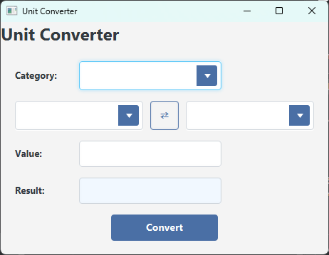

# Unit Converter

A JavaFX-based application for converting units across different categories such as Length, Weight, and Temperature.

## Features

- Select a category (e.g., Length, Weight, Temperature).
- Choose units to convert from and to.
- Input a value and get the converted result.
- Swap units for quick reverse conversion.

## Technologies Used

- **Java**: Core programming language.
- **JavaFX**: For building the user interface.
- **Gradle**: Build automation tool.

## Project Structure

- `src/main/java`: Contains the Java source code.
  - `com.example.converter.ui.javafx.controller.ConverterController`: Handles the application logic.
- `src/main/resources`: Contains FXML files and stylesheets.
  - `ConverterView.fxml`: Defines the UI layout.
  - `styles.css`: Contains the application's styles.

## How to Run

1. Clone the repository:
   ```bash
   git clone  https://github.com/RohanCyberOps/UnitConverter.git
   cd  UnitConverter
   ```

2. Build the project using Gradle:
   ```bash
   ./gradlew build
   ```

3. Run the application:
   ```bash
   ./gradlew run
   ```

## Screenshots



## License

This project is licensed under the MIT License. See the `LICENSE` file for details.
